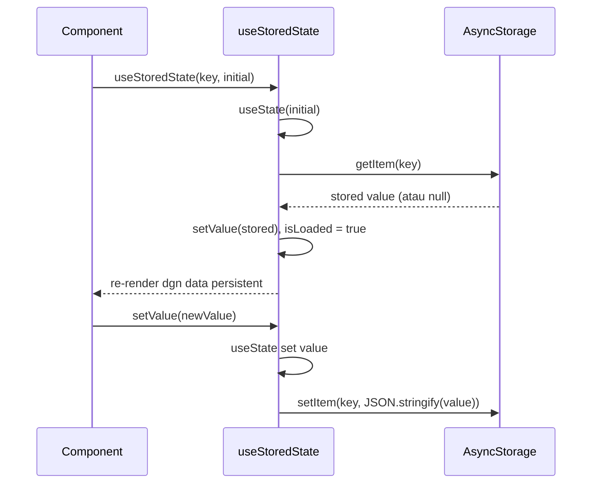
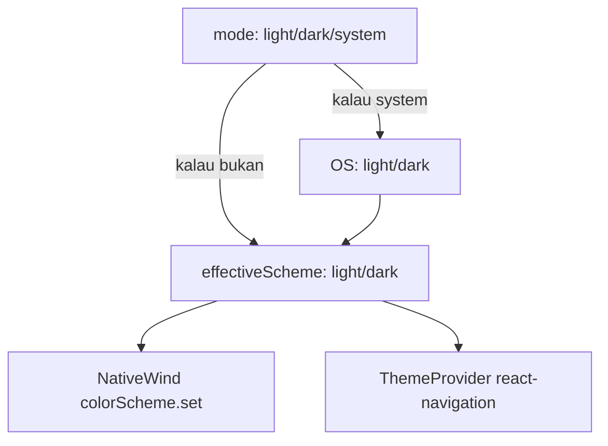
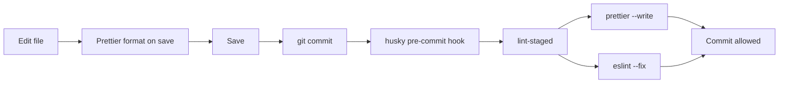
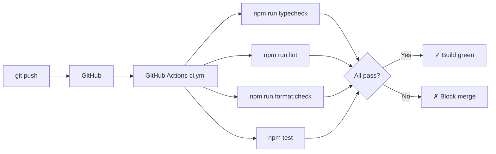

# Changelog 004 — Custom Hooks, Persistence, 2 Mini App Baru, Quality Tooling

**Tanggal:** 2026-05-07
**Tipe:** Feature + Refactor + Setup
**Status:** Selesai

---

## Apa yang Dilakukan

Tujuh kelompok perubahan besar:

1. **Refactor 6 mini app jadi custom hook** — logic terpisah dari UI
2. **AsyncStorage persistence** — Todo, Habit, Expense, Pomodoro session, theme preference, onboarding flag
3. **2 mini app baru** — Pomodoro Timer & Expense Tracker
4. **Settings screen** — manual theme override + reset all data
5. **Onboarding flow** — 3 slide intro, hanya muncul sekali
6. **Sidebar swipe-to-close** — gesture handler integration
7. **Quality tooling** — Prettier, Husky + lint-staged, GitHub Actions CI, Jest tests, EAS Build config

---

## File yang Dibuat / Diubah

### Hooks Baru

| File                          | Fungsi                                                                              |
| ----------------------------- | ----------------------------------------------------------------------------------- |
| `hooks/use-stored-state.ts`   | Generic persistent useState (load/save AsyncStorage otomatis) + `clearAllAppData()` |
| `hooks/use-todos.ts`          | Logic Todo (state, filter, addTodo, toggleTodo, deleteTodo, clearCompleted)         |
| `hooks/use-habits.ts`         | Logic Habit (state, addHabit, toggleDay, deleteHabit, totals)                       |
| `hooks/use-tip-calculator.ts` | Logic Tip Calc (bill, tipPercent, people, derived results)                          |
| `hooks/use-quiz.ts`           | Logic Quiz (state machine, pickAnswer, next, restart) + QUESTIONS data              |
| `hooks/use-pomodoro.ts`       | Logic Timer (mode, secondsLeft, isRunning, completedSessions)                       |
| `hooks/use-expenses.ts`       | Logic Expense (transactions, totals, addTransaction, deleteTransaction)             |

### Lib Util Baru

| File            | Fungsi                                                                                   |
| --------------- | ---------------------------------------------------------------------------------------- |
| `lib/format.ts` | Pure functions: `formatIDR`, `formatTime`, `calcStreak`, `formatRelativeDate` (testable) |

### Context Baru

| File                        | Fungsi                                                               |
| --------------------------- | -------------------------------------------------------------------- |
| `context/theme-context.tsx` | `ThemePreferenceProvider` + `useThemePreference` (light/dark/system) |

### Screen Baru

| File                    | URL              | Fungsi                      |
| ----------------------- | ---------------- | --------------------------- |
| `app/apps/pomodoro.tsx` | `/apps/pomodoro` | Pomodoro Timer              |
| `app/apps/expenses.tsx` | `/apps/expenses` | Expense Tracker             |
| `app/settings.tsx`      | `/settings`      | Theme override + reset data |
| `app/onboarding.tsx`    | `/onboarding`    | 3-slide intro               |

### Tests Baru

| File                       | Fungsi                            |
| -------------------------- | --------------------------------- |
| `__tests__/format.test.ts` | 11 unit test untuk pure functions |

### Config Baru

| File                       | Fungsi                                             |
| -------------------------- | -------------------------------------------------- |
| `.prettierrc.json`         | Config Prettier (single quote, semi, 90 char)      |
| `.prettierignore`          | Files yang di-skip Prettier                        |
| `.lintstagedrc.json`       | Config lint-staged (format + lint on staged files) |
| `.husky/pre-commit`        | Trigger lint-staged saat git commit                |
| `.github/workflows/ci.yml` | CI: typecheck + lint + format check + test         |
| `jest.config.js`           | Config Jest pakai jest-expo preset                 |
| `eas.json`                 | EAS Build config (development/preview/production)  |

### File Diubah

| File                      | Perubahan                                                                                             |
| ------------------------- | ----------------------------------------------------------------------------------------------------- |
| `app/_layout.tsx`         | Wrap dgn `GestureHandlerRootView`, `ThemePreferenceProvider`, `OnboardingGate`. Register screen baru. |
| `app/apps/todo.tsx`       | Refactor pakai `useTodos()`. Tambah list animations (FadeIn/FadeOut/LinearTransition).                |
| `app/apps/habits.tsx`     | Refactor pakai `useHabits()`. Tambah list animations.                                                 |
| `app/apps/calculator.tsx` | Refactor pakai `useTipCalculator()`.                                                                  |
| `app/apps/quiz.tsx`       | Refactor pakai `useQuiz()`.                                                                           |
| `app/(tabs)/apps.tsx`     | Tambah kartu Pomodoro, Expense, Settings link.                                                        |
| `components/sidebar.tsx`  | Tambah pan gesture (swipe-to-close). Tambah 3 menu item baru.                                         |
| `eslint.config.js`        | Integrate `eslint-config-prettier`.                                                                   |
| `package.json`            | Scripts: `format`, `format:check`, `typecheck`, `test`, `prepare`. Tambah devDeps.                    |

---

## Flow 1: Custom Hook Pattern

Sebelum refactor, semua state + handler ada di komponen page (200-300 baris). Setelah refactor:

```tsx
// SEBELUM — todo.tsx 200+ baris
export default function TodoScreen() {
  const [todos, setTodos] = useState<Todo[]>([...]);
  const [input, setInput] = useState('');
  const [filter, setFilter] = useState<Filter>('all');
  const filtered = useMemo(...);
  const addTodo = () => { ... };
  const toggleTodo = (id) => { ... };
  // ... return JSX
}

// SESUDAH — todo.tsx ~100 baris (cuma UI)
export default function TodoScreen() {
  const t = useTodos();
  // ... return JSX
}

// hooks/use-todos.ts — semua logic di sini
export function useTodos() {
  const [todos, setTodos] = useStoredState<Todo[]>('@app/todos', SEED);
  const [input, setInput] = useState('');
  // ...
  return { todos, addTodo, toggleTodo, ... };
}
```

**Manfaat:**

- Component file fokus ke UI saja
- Logic bisa di-test terpisah
- Reuse di komponen lain kalau perlu
- Lebih gampang baca

---

## Flow 2: Generic Persistent State (`useStoredState`)

```tsx
// Drop-in replacement untuk useState — auto save/load
const [todos, setTodos, isLoaded] = useStoredState<Todo[]>('@app/todos', SEED);
```

### Mekanisme Internal



**Detail penting (`hooks/use-stored-state.ts`):**

- `skipNextSave` ref → cegah save ke-pertama saat data baru di-load (kalau tidak, akan overwrite dgn initial)
- `cancelled` flag → cegah race condition saat key berubah cepat
- Try/catch JSON.parse → kalau data corrupt, fallback ke initial

### Convention Naming Key

Semua key di-prefix `@app/`:

- `@app/todos`
- `@app/habits`
- `@app/transactions`
- `@app/pomodoro-sessions`
- `@app/theme-mode`
- `@app/onboarding-done`

`clearAllAppData()` di `use-stored-state.ts` cuma hapus key yang prefix-nya cocok — data lib lain tidak terganggu.

---

## Flow 3: Pomodoro Timer

### State

```ts
mode: 'focus' | 'break';
secondsLeft: number;
isRunning: boolean;
completedSessions: number; // PERSISTENT
```

### Cara Kerja `setInterval` di React

```tsx
useEffect(() => {
  if (!isRunning) return;
  intervalRef.current = setInterval(() => {
    setSecondsLeft((s) => {
      if (s <= 1) {
        clearInterval(intervalRef.current);
        // auto switch focus → break, +1 session
        return BREAK_SECONDS;
      }
      return s - 1;
    });
  }, 1000);

  return () => clearInterval(intervalRef.current);
}, [isRunning]);
```

**Pelajaran kunci:**

1. `useRef` untuk simpan interval ID — supaya cleanup function bisa akses
2. **Functional updater** `setSecondsLeft((s) => ...)` — wajib karena setInterval callback baca state stale
3. **Cleanup di useEffect return** — kalau component unmount sebelum interval selesai, hentikan
4. **Re-run effect saat `isRunning` berubah** — pause = setIsRunning(false) → cleanup jalan

---

## Flow 4: Theme Override



**`context/theme-context.tsx`** menyimpan preference user di AsyncStorage. Saat mode berubah, sync ke `nativewind.colorScheme.set()` dan ke `ThemeProvider` dari react-navigation. Hasilnya: tab bar header + className `dark:` semua mengikuti.

---

## Flow 5: Onboarding Gate

```tsx
function OnboardingGate({ children }) {
  const [checked, setChecked] = useState(false);
  const router = useRouter();
  const segments = useSegments();

  useEffect(() => {
    AsyncStorage.getItem('@app/onboarding-done').then((v) => {
      const done = v === 'true';
      const onOnboardingScreen = segments[0] === 'onboarding';
      if (!done && !onOnboardingScreen) {
        router.replace('/onboarding');
      }
      setChecked(true);
    });
  }, []);

  if (!checked) return null; // jangan render apa-apa sampai status diketahui
  return <>{children}</>;
}
```

**Pattern penting:**

- Render `null` selama status belum diketahui → cegah flash konten utama
- Pakai `router.replace()` (bukan `push`) → tidak bisa back ke screen sebelumnya
- Cek `segments[0] === 'onboarding'` → cegah redirect loop

Setelah user tap "Mulai" di onboarding terakhir:

```tsx
await AsyncStorage.setItem('@app/onboarding-done', 'true');
router.replace('/(tabs)');
```

---

## Flow 6: Sidebar Pan Gesture

```tsx
const panGesture = Gesture.Pan()
  .activeOffsetX([-10, 10])  // baru aktif kalau drag > 10px
  .onUpdate((e) => {
    const next = Math.min(0, e.translationX);
    if (next < 0) translateX.value = next;  // hanya respon drag ke kiri
  })
  .onEnd((e) => {
    const shouldClose =
      e.translationX < -SIDEBAR_WIDTH / 3 ||  // drag > 1/3 lebar
      e.velocityX < -500;                     // ATAU swipe cepat
    if (shouldClose) {
      translateX.value = withTiming(-SIDEBAR_WIDTH, {...}, () => {
        runOnJS(close)();  // panggil close dari Context
      });
    } else {
      translateX.value = withTiming(0, {...});  // snap back open
    }
  });

<GestureDetector gesture={panGesture}>
  <Animated.View style={panelStyle}>...</Animated.View>
</GestureDetector>
```

**Aturan UX yang dipakai:**

- Threshold posisi (1/3 lebar) ATAU velocity (500 px/s)
- Drag ke kanan diabaikan — sidebar tidak bisa "lebih terbuka"
- `runOnJS(close)` karena callback animasi jalan di UI thread, sedangkan `close()` adalah React setter

---

## Flow 7: Quality Tooling Pipeline

### Local development



### Push to GitHub



---

## Konsep Baru

| Konsep                                   | Pertama muncul di                  |
| ---------------------------------------- | ---------------------------------- |
| Custom hook ekstraksi                    | semua `hooks/use-*.ts`             |
| Generic typed hook (`useStoredState<T>`) | `hooks/use-stored-state.ts`        |
| AsyncStorage CRUD                        | `hooks/use-stored-state.ts`        |
| `useRef` untuk setInterval ID            | `hooks/use-pomodoro.ts`            |
| `useEffect` cleanup function             | `hooks/use-pomodoro.ts`            |
| `useSegments`, `useRouter`               | `app/_layout.tsx` (OnboardingGate) |
| `Animated.View entering/exiting`         | list di Todo, Habits, Expenses     |
| `LinearTransition` layout animation      | items rearrange smooth             |
| `Gesture.Pan` + `GestureDetector`        | sidebar swipe                      |
| `nativewind.colorScheme.set()`           | theme override                     |
| `Alert.alert` confirmation dialog        | settings reset data                |
| `ScrollView horizontal pagingEnabled`    | onboarding slides                  |
| Pure function extraction untuk testing   | `lib/format.ts`                    |
| Jest unit testing                        | `__tests__/format.test.ts`         |

---

## Dependencies Baru

```json
{
  "dependencies": {
    "@react-native-async-storage/async-storage": "2.2.0",
    "react-native-gesture-handler": "~2.28.0"
  },
  "devDependencies": {
    "prettier": "^3.x",
    "eslint-config-prettier": "^10.x",
    "eslint-plugin-prettier": "^5.x",
    "husky": "^9.x",
    "lint-staged": "^16.x",
    "jest": "^29.x",
    "jest-expo": "^54.x",
    "@types/jest": "^29.x"
  }
}
```

---

## Cara Coba Fitur Baru

```bash
npm run start

# Onboarding muncul otomatis pertama kali
# Setelah selesai:
# - /apps/pomodoro → start timer 25 menit
# - /apps/expenses → tambah transaksi
# - /settings → ganti theme manual

# Quality checks lokal
npm run typecheck
npm run lint
npm run format
npm test

# Pre-commit hook auto jalan saat git commit
git add .
git commit -m "test commit"  # akan run lint-staged otomatis
```
