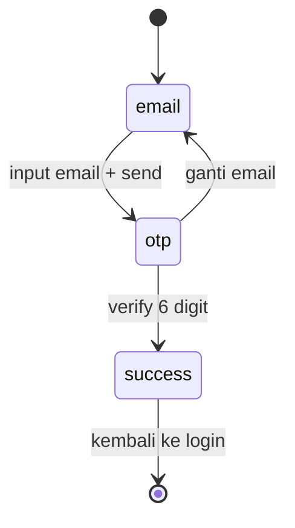

# Changelog 007 — Native APIs, Auth Flow, Charts, Bottom Sheet, Playground

**Tanggal:** 2026-05-07
**Tipe:** Feature (massive)
**Status:** Selesai

---

## Apa yang Dilakukan

Tambahan besar yang menyentuh hampir semua bagian project:

1. **Toast system** — feedback non-blocking dengan animasi (replace banyak `Alert.alert`)
2. **Push Notifications** — schedule, daily reminder, cancel
3. **Audio (sound effects)** — click, success
4. **Haptic feedback** — terintegrasi di semua interaksi penting (Pomodoro, Quiz, Shop, Toast, Confetti)
5. **Confetti animation** — overlay global, dipicu saat checkout & quiz 100%
6. **Bottom Sheet** — replace Modal cart dengan @gorhom/bottom-sheet
7. **Auth flow (mock)** — Login, Register, Forgot Password (3-step), Profile
8. **Product Detail Page** — Stack drill-down dari Shop dengan galeri, spec, related
9. **Charts** — Pie chart breakdown expense per kategori
10. **Playground page** — demo page dengan tombol test untuk setiap fitur baru

---

## File yang Dibuat / Diubah

### Utility & Library

| File                   | Fungsi                                                                                   |
| ---------------------- | ---------------------------------------------------------------------------------------- |
| `lib/haptic.ts`        | Wrapper expo-haptics (light/medium/heavy/selection/success/warning/error)                |
| `lib/sound.ts`         | Wrapper expo-av untuk play sound dari URL                                                |
| `lib/notifications.ts` | scheduleIn, scheduleDailyReminder, cancelAll, getScheduledCount + setNotificationHandler |

### Context Providers

| File                           | Fungsi                                                             |
| ------------------------------ | ------------------------------------------------------------------ |
| `context/toast-context.tsx`    | ToastProvider + useToast (success/error/info/warning)              |
| `context/confetti-context.tsx` | ConfettiProvider + useConfetti.fire()                              |
| `context/auth-context.tsx`     | AuthProvider + useAuth (login/register/logout/updateProfile, mock) |

### Komponen

| File                              | Fungsi                                            |
| --------------------------------- | ------------------------------------------------- |
| `components/confetti-overlay.tsx` | Wrapper ConfettiCannon dengan useImperativeHandle |

### Screen Baru

| File                     | URL              | Fungsi                                        |
| ------------------------ | ---------------- | --------------------------------------------- |
| `app/playground.tsx`     | `/playground`    | Demo page dengan tombol test 9 kategori fitur |
| `app/profile.tsx`        | `/profile`       | Profile screen (login state aware)            |
| `app/auth/_layout.tsx`   | —                | Stack layout untuk auth                       |
| `app/auth/login.tsx`     | `/auth/login`    | Email + password + social login mock          |
| `app/auth/register.tsx`  | `/auth/register` | Form daftar dengan password strength meter    |
| `app/auth/forgot.tsx`    | `/auth/forgot`   | 3-step: email → OTP 6-digit → success         |
| `app/apps/shop/[id].tsx` | `/apps/shop/:id` | Detail produk dengan spec + related           |

### Screen Diubah

| File                      | Perubahan                                                                                                              |
| ------------------------- | ---------------------------------------------------------------------------------------------------------------------- |
| `app/_layout.tsx`         | Wrap dengan AuthProvider, ToastProvider, ConfettiProvider. Register screens baru. Import lib/notifications side-effect |
| `app/apps/shop/index.tsx` | Restructure dari shop.tsx ke folder. Replace Modal dengan BottomSheet. Tambah toast/haptic/confetti                    |
| `app/apps/expenses.tsx`   | Tambah PieChart breakdown per kategori                                                                                 |
| `app/apps/pomodoro.tsx`   | Haptic + sound + schedule notif backup saat start                                                                      |
| `app/apps/quiz.tsx`       | Haptic per jawaban (success/error). Confetti saat score 100%                                                           |
| `app/(tabs)/apps.tsx`     | Tambah kartu Playground                                                                                                |
| `components/sidebar.tsx`  | Tambah section "Akun" (Profile/Login/Daftar) + "Playground" di Sistem                                                  |

---

## Bagian 1: Toast System

```tsx
const toast = useToast();

toast.success('Item berhasil ditambah');
toast.error('Login gagal');
toast.warning('Stok hampir habis');
toast.info('Cek email kamu');
```

Implementasi:

- Provider menyimpan queue `toasts: ToastItem[]`
- Render absolute di top, `pointerEvents="box-none"` (tidak block touch)
- Auto-dismiss 2.5s pakai `setTimeout`
- Animated entrance/exit (`FadeInDown`/`FadeOutDown` dari Reanimated)
- Tap untuk dismiss manual
- **Bonus**: auto-trigger haptic sesuai variant (success/warning/error)

---

## Bagian 2: Notifications

### Setup

```tsx
// lib/notifications.ts (di module top-level — auto-jalan saat import)
Notifications.setNotificationHandler({
  handleNotification: async () => ({
    shouldShowBanner: true,
    shouldShowList: true,
    shouldPlaySound: true,
    shouldSetBadge: false,
  }),
});
```

[!warning]
**Wajib** import side-effect ini sekali di app/\_layout.tsx:

```tsx
import '@/lib/notifications';
```

Tanpa setNotificationHandler, notif foreground tidak muncul di iOS.

### Schedule

```tsx
import {
  scheduleIn,
  scheduleDailyReminder,
  cancelAllNotifications,
} from '@/lib/notifications';

// Sekali, dalam X detik
await scheduleIn(5, 'Halo', 'Body notif');

// Berulang setiap hari jam X:Y
await scheduleDailyReminder(9, 0, 'Reminder belajar', 'Buka project!');

// Cancel semua
await cancelAllNotifications();
```

### Permission

Function `ensureNotificationPermission()` cek + minta permission. Kalau ditolak, return false → caller bisa show toast error.

### Pemakaian Real di Pomodoro

```tsx
const handleStart = async () => {
  haptic.medium();
  p.start();
  // Backup notif kalau user keluar app sebelum timer selesai
  await cancelAllNotifications();
  await scheduleIn(p.secondsLeft, '⏱️ Fokus selesai!', 'Saatnya istirahat 5 menit.');
};

const handlePause = async () => {
  haptic.light();
  p.pause();
  await cancelAllNotifications();
};
```

Logic: schedule notif dengan delay = secondsLeft saat ini. Kalau timer tetap berjalan & user keluar app, notif tetap muncul tepat waktu.

---

## Bagian 3: Audio + Haptic + Confetti

3 utility kecil, di-trigger bersama untuk multisensory feedback:

```tsx
// Combo "win" feedback
haptic.success();
sound.success();
confetti.fire();
toast.success('Berhasil!');
```

### Haptic

```tsx
haptic.light(); // tap halus
haptic.medium(); // konfirmasi action
haptic.heavy(); // important action
haptic.selection(); // pilihan picker
haptic.success(); // notif sukses (3 pulse)
haptic.warning(); // notif warning
haptic.error(); // notif error (2 pulse berbeda)
```

Wrapper guard `Platform.OS === 'ios' || 'android'` — di web jadi no-op silently.

### Confetti

Pakai `useImperativeHandle` + ref pattern:

```tsx
// Provider render satu ConfettiOverlay di root
<ConfettiOverlay ref={cannonRef} />;

// Dipanggil dari mana saja
const confetti = useConfetti();
confetti.fire();
```

Component dengan `pointerEvents="none"` — tidak block touch user.

---

## Bagian 4: Bottom Sheet (Replace Modal)

### Sebelum: Modal

```tsx
<Modal animationType="slide" transparent visible={cartOpen}>
  <View className="flex-1 bg-black/50 justify-end">
    <View className="bg-white rounded-t-3xl max-h-[85%]">...</View>
  </View>
</Modal>
```

Issues: tidak draggable, animasi statis, layout custom.

### Sesudah: @gorhom/bottom-sheet

```tsx
import BottomSheet, {
  BottomSheetBackdrop,
  BottomSheetView,
  BottomSheetScrollView,
} from '@gorhom/bottom-sheet';

const sheetRef = useRef<BottomSheet>(null);
const snapPoints = useMemo(() => ['60%', '88%'], []);

<BottomSheet
  ref={sheetRef}
  index={-1} // start closed
  snapPoints={snapPoints}
  enablePanDownToClose
  onChange={setSheetIndex}
  backdropComponent={renderBackdrop}>
  <BottomSheetView>{/* konten */}</BottomSheetView>
</BottomSheet>;

// Open: sheetRef.current?.snapToIndex(0)
// Close: sheetRef.current?.close()
```

**Manfaat:**

- Drag-able (swipe down untuk close)
- Multi-snap (60% → 88%)
- Backdrop animasi smooth
- BottomSheetScrollView untuk content yang panjang (tidak conflict dengan drag gesture)

---

## Bagian 5: Auth Flow (Mock)

4 screen tanpa server. Auth state disimpan di AsyncStorage `@app/auth-user`.

### Login screen highlights

- Email + password input
- Show/hide password toggle
- Social login buttons (Google + Apple) — mock dengan toast
- Link ke "Lupa password" + "Daftar"
- KeyboardAvoidingView (input tidak ketutup keyboard)

### Register screen highlights

- Nama + email + password + konfirmasi
- **Password strength meter** real-time:

```tsx
function getPasswordStrength(pw: string) {
  let score = 0;
  if (pw.length >= 8) score++;
  if (/[A-Z]/.test(pw)) score++;
  if (/[a-z]/.test(pw)) score++;
  if (/\d/.test(pw)) score++;
  if (/[^A-Za-z0-9]/.test(pw)) score++;
  // map score → label + color + percent
}
```

- Konfirmasi password — border merah/hijau real-time
- Checkbox T&C wajib di-tick

### Forgot Password — 3-step



OTP UI: 6 input box terpisah, masing-masing maxLength=1, keyboardType numeric.

### Profile Screen

- Loading state saat AsyncStorage load
- Belum login → tampilkan CTA Login + Daftar
- Sudah login → avatar + name + email + menu (Edit, Notif, Settings) + Logout

### Pattern Mock Auth

```tsx
const login = async (email, _password) => {
  if (!email.includes('@')) return { ok: false, error: 'Email tidak valid' };
  await persist({ name: email.split('@')[0], email, avatar: pickAvatar(email) });
  return { ok: true };
};
```

Auto-sukses untuk demo. Avatar di-derive dari hash email → konsisten.

---

## Bagian 6: Product Detail Page

### Restructure Shop

Sebelum:

```
app/apps/shop.tsx              → /apps/shop
```

Sesudah:

```
app/apps/shop/index.tsx        → /apps/shop
app/apps/shop/[id].tsx         → /apps/shop/123
```

Pattern sama dengan Posts (`(tabs)/posts.tsx` + `posts/[id].tsx`).

### Detail Screen Sections

1. Hero image (aspect-square emoji)
2. Card info: kategori badge + judul + wishlist icon
3. Rating + jumlah review + stok
4. Price + diskon mock + persen off
5. Deskripsi
6. Spesifikasi (table-like)
7. Produk serupa (horizontal scroll same category)
8. Sticky bottom action bar (price + add/stepper)

### Sticky Bottom Bar

Pattern penting: action bar tetap visible saat scroll.

```tsx
<View className="absolute left-0 right-0 bottom-0 bg-white border-t flex-row">
  <View>
    <Text>Total</Text>
    <Text>{formatIDR(price)}</Text>
  </View>
  {qty === 0 ? <AddButton /> : <Stepper />}
</View>
```

ScrollView pakai `pb-32` untuk space.

---

## Bagian 7: Charts

`react-native-gifted-charts` — simple API tanpa setup berat:

```tsx
import { PieChart } from 'react-native-gifted-charts';

<PieChart
  data={breakdown.slices.map((s) => ({ value: s.amount, color: s.color }))}
  radius={70}
  innerRadius={48}
  donut
  centerLabelComponent={() => (
    <View>
      <Text>Total</Text>
      <Text>{formatIDR(total)}</Text>
    </View>
  )}
/>;
```

Donut chart (lubang tengah) lebih rapi untuk dashboard, ada space untuk total.

### Build Data Pakai useMemo

```tsx
function buildExpenseBreakdown(transactions) {
  const expenses = transactions.filter((t) => t.type === 'expense');
  const total = expenses.reduce((sum, t) => sum + t.amount, 0);

  const byCategory = {};
  for (const t of expenses) {
    byCategory[t.category] = (byCategory[t.category] ?? 0) + t.amount;
  }

  const slices = Object.entries(byCategory)
    .sort((a, b) => b[1] - a[1])
    .map(([category, amount], i) => ({
      category,
      amount,
      color: PIE_COLORS[i % PIE_COLORS.length],
      percent: (amount / total) * 100,
    }));

  return { slices, total };
}
```

---

## Bagian 8: Playground Page

Akses: `/playground` (juga di Apps tab + Sidebar Sistem section).

10 section dengan tombol untuk test:

1. Toast — success/error/warning/info
2. Haptic — light/medium/heavy + selection/success/warning/error
3. Audio — click, success
4. Notifications — schedule 5s, daily 09:00, cancel all, count
5. Confetti — trigger
6. Bottom Sheet — open demo sheet
7. Auth flow — Login/Daftar/Lupa/Profile
8. Shop Detail — open detail produk
9. Combo — fire haptic + sound + confetti + toast bersamaan

Semua tombol pakai `TestButton` reusable component dengan variant:

```tsx
type ButtonProps = {
  label: string;
  onPress: () => void;
  emoji?: string;
  variant?: 'primary' | 'success' | 'warning' | 'danger' | 'neutral';
};
```

---

## Konsep Baru Diintroduksi

| Konsep                                                  | Lokasi                                       |
| ------------------------------------------------------- | -------------------------------------------- |
| `useImperativeHandle` + ref-based imperative API        | confetti-overlay                             |
| Notification handler module-level (side-effect import)  | lib/notifications                            |
| Permission request pattern                              | ensureNotificationPermission                 |
| Schedule with TimeIntervalTrigger / DailyTrigger        | lib/notifications                            |
| Audio.Sound dynamic load + auto-unload                  | lib/sound                                    |
| Provider composition (4 levels deep)                    | app/\_layout.tsx                             |
| KeyboardAvoidingView Platform-specific behavior         | auth screens                                 |
| Multi-step form dengan state machine                    | forgot.tsx (`'email' \| 'otp' \| 'success'`) |
| OTP input pattern (multiple TextInput)                  | forgot.tsx                                   |
| Password strength meter                                 | register.tsx                                 |
| `@gorhom/bottom-sheet` snap points + backdrop           | shop, playground                             |
| Static method `BottomSheetScrollView` (drag-friendly)   | shop cart                                    |
| Donut chart dengan center label                         | expenses.tsx                                 |
| Reduce + groupBy untuk chart data                       | buildExpenseBreakdown                        |
| Auth state via AsyncStorage                             | useAuth                                      |
| Stack drill-down route ke detail                        | apps/shop/[id].tsx                           |
| Sticky bottom action bar                                | shop detail                                  |
| `useRef` untuk track previous value (detect transition) | pomodoro mode change                         |
| Confetti trigger conditional via useEffect              | quiz finish 100%                             |

---

## Dependencies Baru

```json
{
  "expo-notifications": "~0.32.x",
  "expo-av": "~16.x",
  "react-native-svg": "15.12.x",
  "@gorhom/bottom-sheet": "^5.x",
  "react-native-gifted-charts": "^1.4.x",
  "react-native-confetti-cannon": "^1.5.x"
}
```

`expo-haptics` sudah ada sebelumnya, tinggal pakai.

---

## Cara Coba

```bash
npm run start
```

Buka:

- **Apps tab → Playground** (`/playground`) — test semua fitur via tombol
- **Apps tab → Mini Shop** — Bottom Sheet cart, tap produk → detail
- **Apps tab → Pomodoro** — start timer (haptic + sound + notif) lalu keluar app
- **Apps tab → Quiz** — jawab semua benar → confetti
- **Apps tab → Expenses** — lihat pie chart breakdown
- **Sidebar → Akun** — Profile / Login / Daftar
- **Sidebar → Sistem → Playground** — shortcut

---

## Coba Sendiri

1. **Tambah snapshot test** untuk Toast component dengan React Native Testing Library.
2. **Real auth** — connect Supabase / Firebase, ganti mock.
3. **Detail page produk** + galeri image (Image carousel).
4. **Bar chart** untuk Pomodoro sessions per hari.
5. **Push notif scheduled per habit** — reminder personal di jam tertentu.
6. **Tambah tombol "Edit Profile"** yang functional di profile.tsx.
